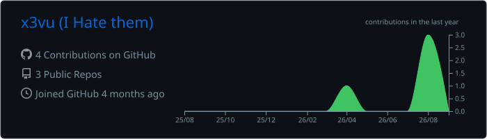
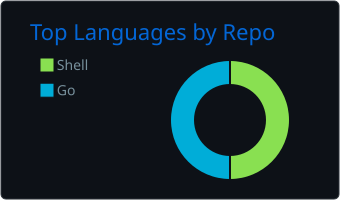
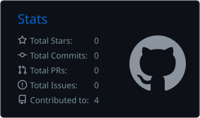
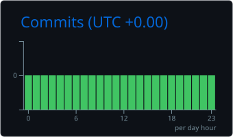

<div align="center">

<!-- ═══════════════════════ 封面 · HEADER ═══════════════════════ -->


<a href="https://github.com/x3vu">
  
</a>

<!-- ═══════════════════════ 徽章 · BADGES ═══════════════════════ -->

[](https://github.com/x3vu?tab=followers)
[](https://github.com/x3vu?tab=repositories)
[](https://github.com/x3vu)


---

<!-- ═══════════════════════ 侠客行 · MANIFESTO ═══════════════════════ -->

## 「侠客行」 · The Manifesto

> **十步杀一人，千里不留行。**
> *Ten paces, one binary slain — a thousand miles, no trace left behind.*
>
> 李白写过刺客，我写加载命令。他把刀藏进诗里，我把 dylib 藏进 Mach-O。

```text
$ whoami
Blessed — 独立开发者 / iOS 逆向研究者 / 纯函数 Go 信徒

$ cat 道.md
· 一切皆文件：IPA 是 zip，签名是 DER，固件是 tar —— 拆开看。
· 纯净即正义：一个二进制走天下（idev），不装 Python，不求虚拟环境。
· 忠实于上游：转换器逐字节对齐生态工具，偏差必须写进文档。
· 测试先行：行为改动必带测试；网络路径一律 hermetic。
```

<br/>

<!-- ═══════════════════════ 兵器谱 · PROJECTS ═══════════════════════ -->

## ⚔️ 兵器谱 · The Arsenal

<table>
<tr><td valign="top" width="50%">

### 🐉 idev — iPhone, from the terminal
**纯 Go 的 pymobiledevice3 替代品**

One static binary that pairs, installs, launches, streams logs, takes
screenshots, forwards ports and reads the clipboard. On iOS 17+ it spawns
its own CoreDevice tunnel instead of asking you to babysit one.

`Go` `usbmuxd` `CoreDevice`

</td><td valign="top" width="50%">

### 🜲 xKVM — iOS tweak toolbox
**cyan/pyzule-rw 血统的纯 Go 重写**

Inject tweaks into IPAs, extract them back out, convert packages between
jailbreak layouts — byte-faithful converters pinned by golden tests, all
Mach-O surgery done in pure Go. No ldid, no insert_dylib.

`Mach-O` `codesign` `golden-tests`

</td></tr>
</table>

<details>
<summary>📜 <b>更多兵器 · more weapons in the forge（点开查看）</b></summary>
<br/>

| 兵器 | 道 | status |
|---|---|---|
| idev | 纯 Go 设备驱动层：backup/afc/recovery/ddi | 🔥 active |
| xKVM | 注入器 · 提取器 · 越狱包转换器 | 🔥 active |
| legacy reach | iOS 5–16 老设备驱动支持 | 🧪 matrix building |
| backup2 port | M7：完整备份/恢复协议移植 | 📋 planned |

</details>

<br/>

<!-- ═══════════════════════ 技艺 · STACK ═══════════════════════ -->

## 🧠 技艺 · Craft

<a href="https://skillicons.dev">
  
</a>

```text
精通 Go 到什么程度？—— 我用 blacktop/go-macho 手写了 growing-rename，
让链接编辑段的每一条加载命令在字符串变长后重新对齐。otool 都挑不出毛病。
```

<br/>

<!-- ═══════════════════════ 战绩 · STATS ═══════════════════════ -->

## 📊 战绩 · Battle Record

<picture>
  <source media="(prefers-color-scheme: dark)" srcset="https://github-readme-stats.vercel.app/api?username=x3vu&show_icons=true&theme=radical&hide_border=true&bg_color=0d1117&title_color=E100FF&icon_color=9C27B0&text_color=c9d1d9&include_all_commits=true&count_private=true"/>
  
</picture>
<picture>
  <source media="(prefers-color-scheme: dark)" srcset="https://streak-stats.demolab.com?user=x3vu&theme=radical&hide_border=true&background=0d1117&ring=E100FF&fire=FF6D00&currStreakLabel=9C27B0"/>
  
</picture>


[](https://github.com/x3vu)

<table>
<tr>
<td></td>
<td></td>
<td></td>
<td></td>
</tr>
</table>


<br/>

<!-- ═══════════════════════ 贪吃蛇 · THE SNAKE ═══════════════════════ -->

## 🐍 贪吃蛇 · It eats my commits

<picture>
  <source media="(prefers-color-scheme: dark)" srcset="./snake-dark.svg"/>
  <source media="(prefers-color-scheme: light)" srcset="./snake.svg"/>
  
</picture>

*每天零点后自动重绘 —— 它吃的是我的睡眠。*
*(redrawn by GitHub Actions after midnight UTC — it eats my sleep.)*

<br/>

<!-- ═══════════════════════ 禅 · ZEN ═══════════════════════ -->

## 🍵 禅 · One line of Zen

<!-- zen-quote:start -->
> **「工欲善其事，必先利其器。」**
> *— 孔子 · Confucius, roughly describing why I wrote idev*
<!-- zen-quote:end -->

<br/>

<!-- ═══════════════════════ 联络 · CONNECT ═══════════════════════ -->

## 📮 联络 · Reach me

<a href="mailto:zeeforeal.l@gmail.com"></a>
<a href="https://github.com/x3vu"></a>

<br/>

---

<!-- ═══════════════════════ 尾声 · FOOTER ═══════════════════════ -->


*此页由 GitHub Actions 自动供养 · fed by automation · 最后构建见 [Actions](https://github.com/x3vu/x3vu/actions)*

</div>
